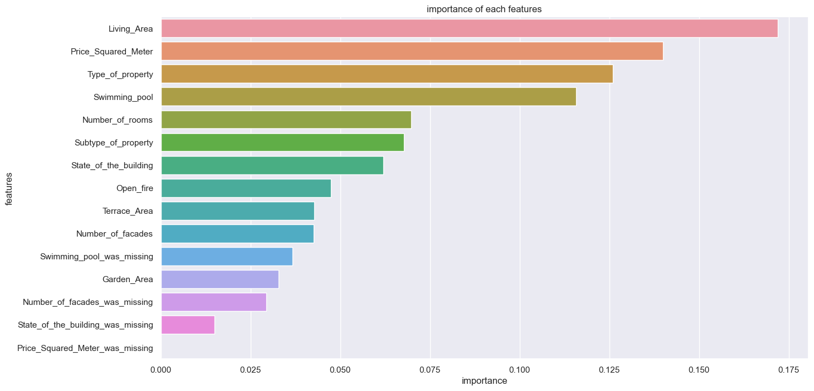
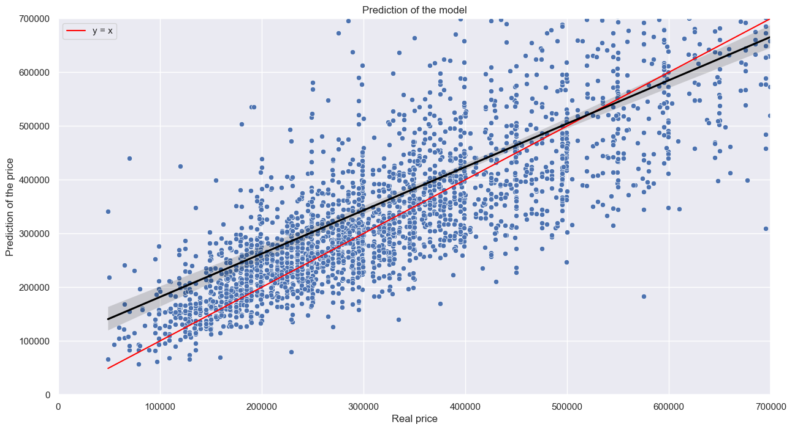

# real-estate-price-prediction
# Data scrapping

## Description
The goal of this project was to collect information from the [immoweb website](https://www.immoweb.be/en/search/house/for-sale?countries=BE&page=1&orderBy=relevance). We had to gather information about at least 10,000 properties all over Belgium and create a CSV file with the following columns.
* __Locality__
* __Type of property__ (House/apartment)
* __Subtype of property__ (Bungalow, Chalet, Mansion, ...)
* __Price__
* __Type of sale__ (Exclusion of life sales)
* __Number of rooms__
* __Living Area__
* __Fully equipped kitchen__ (Yes/No)
* __Furnished__ (Yes/No)
* __Open fire__ (Yes/No)
* __Terrace__ (Yes/No)
 -If yes: Area
* __Garden__ (Yes/No)
 -If yes: Area
* __Surface of the land__ (is none for each line, the information is given in the line : Surface area of the plot of land)
* __Surface area of the plot of land__ 
* __Number of facades__
* __Swimming pool__ (Yes/No)
* __State of the building__ (New, to be renovated, ...)

The dataset had to be clean in the sense of recording only numerical values. 

## Installation

The following packages were useful in order to make the project work: 

* json (built-in); 
* pandas (pip install pandas);
* bs4 (pip install bs4);
* selenium (pip install selenium);
* threading.
* matplotlib
* sklearn

## Structure of the code

Our program consists of three different parts. The first part of the program is responsible for gathering all the necessary links that will be used for data collection. The second part of the program uses the collected links to scrape information from those webpages. The final step of the program is to "clean" the data that has been collected. This includes removing duplicates and formatting data to have (mainly) numerical values. However, the data is not processed to remove any errors or inconsistencies. 

### 1) Collecting the links
The aim of the [links_collection.ipynb](./data_acquisition/links_collection.ipynb) file is to collect the links of all houses and apartment for sale on the immoweb website. In practice, the house and apartment sections are done in parallel (using threads) and both are following the same algorithm:
* __first__, The algorithm goes through the 333 pages that are available:
* __then__, scrapes these pages to get all the links it contains
* 
* __lastly__, This part creates a csv file called [links.csv](./data_acquisition/links.csv) which stores all the links collected.

### 2) Scraping all the links
For all the links that are stored in the links.csv file, [house_scrapping.ipynb](./data_acquisition/house_scrapping.ipynb) will:
* open the link
* scrape the available information
* 
* store all the collected information into different csv files called all_info_TeamMember1_1-5000.csv, all_info_TeamMember1_1-10000.csv, all_info_TeamMember2_10000-15000.csv, etc. These files will be merged in the next step of the program. 

In this csv file, each line represents a new house/apartment. The column names are given in the Description section. In this part a special type of multithreading was implemented, which is called teamwork: 
- pip install nicePeople
- from nicePeople import teamwork 

 We have splitted the links (20000 in total) in three to collect the information in parallel. The reason for this was to minimize the risk of being blocked by the immoweb website if we'd have used 'real' concurrency. 

### 3) Cleaning the data

In this last part [merge_and_clean_data.ipynb](./data_acquisition/merge_and_clean_data.ipynb) we will merge all the csv files from the previous part. The dataframe is not clean yet. We only want to retrieve numerical values. So this part of code will include a mapping which is explained in the 'usage' of this 'readme' file.

## Usage

### 1) Collecting the data 
You can use any WebDriver through Selenium to get and extract the URL of each page. The Firefox WebDriver was used in this project with an additional option (headless) which doesn't show the process of opening and closing the pages. 

In order to collect the links of all houses and apartments for sale, we had a look on the website of immoweb and found 333 pages for each property type. This is something you need to check and change manually when running the program. You can also add an additional variable 'end_pagenumber' and scrape this information from the website. 

This workprocess will take about 1 hour. 

### 2) Scraping all the links

This (shared) workprocess can take up to 4 hours when divided between two or more computers. When there's a problem while running, the code will store the scraped information under a CSV file. The program will continue working with a new CSV file. You can add your name to distinguish between team members.

This will of course cause an additional task to merge all the CSV files. The [merge_and_clean_data.ipynb](./data_acquisition/merge_and_clean_data.ipynb) will execute this for you. 

### 3) Cleaning the data

The function 'create_df' will merge all the csv files into a single dataframe. This dataframe will have non-numerical values. In order to get only numerical values we have written the function clean_df. This part of the code will replace string values by numerical values (using mapping). 

## Visuals
In this part we would like to illustrate some visuals about the output of this program. After cleaning the data, the dataframe looks as follows:

Here we can see that the dataframe consists only of numerical values like required. We can see that the data is (almost) evenly distributed between the two property types (house/apartment) as we see from the pie chart below:

# Analysis

On the folder data_analysis I tried to analyse the data that was scrapped during the previous part. You can have an overview of my analysis in the file [Main_analyse](./data_analysis/Main_analyse.ipynb). My main goal was to visualise the influence of the living area on the price of a property.

The following plot shows the price of a property in function of the living area, we do not see any relation between these two variabes.

This is due to the fact that each locality has his own price per square meter. We can see on the following graph that there is a clear correlation between the living area of one property and his price, at least for the Locality tested.

Testing all the localities one by one would be impossible. This is why I used the following strategy:
* with 80% of the dataset compute the price per square meters for each localities
* with the 20% compare the 2 following thing:
* the price of the property
* the value of (price/sqaure_meter) * living area

The given strategy will gives us a graph comparing two prices, the more the dots will be close to the reference line x=y the more the variable living area is important in the price of a property.

While there is still a great variations between the value of the supposed price and the value of the real price we can see that the living area has a great influence on the price

* dots __above__ the line y=x are properties which have a real price lower than expected, it can be caused by a huge propery which has to be renoved
* dots __under__ the line y=x are properties which havea real price higher than expected, it can be caused by a property which is as new,...

# Model
This part is divided in 3 different file:
* __create_csv__, this file will take the csv containing the data we scrapped and create a new csv file that will be used to train and test our model
* __model__, is a file containing my tests on the differents model, hyperparametters, ... (do not run it, it takes time)
* __model_opti__, this file is the model I used.

I used xgboost as regressor model and I got an efficiency of about 76-78%. Here are some visualisations of my results:
At first we can see the effect every features have on the model. We see that the living area and the median price per square meter for each localities and the type of property have the highest influence. We also see that the column price_squared_meter_was_missing has no effect. This is normal in my implementation, indeed the model is train witout missing values on this column.

On the second plot, we see the efficiency of the model, the price the model predicted in function of the real price of the property.

Now, let's zoom on the part where real price is under 700000 € (values that interest most of the people). We see that the model overestimate the price of these properties.

